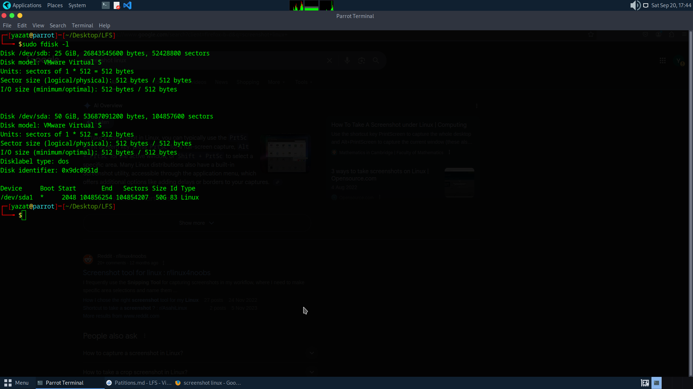
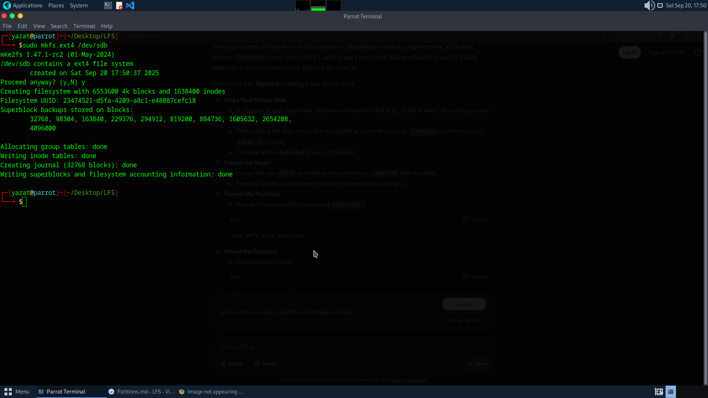
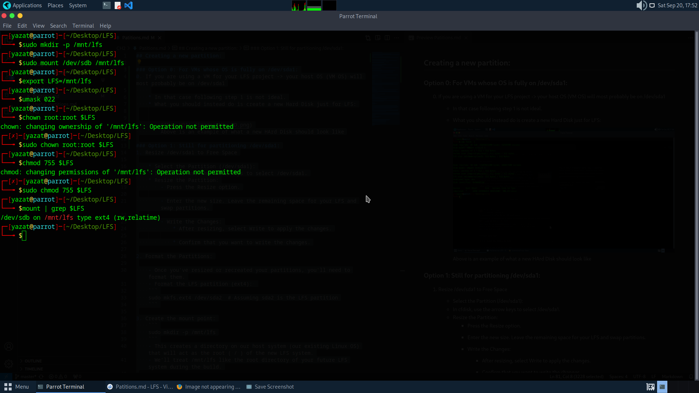

## Creating a new partition:

### Option 0: For VMs whose OS is fully on /dev/sda1:
0. If you are using a VM for your LFS project -> your host OS (VM OS) will most probably be on /dev/sda1
    
    * In that case following step 1 is not ideal.
    * What you should instead do is create a new Hard Disk just for LFS:


        

### Option 1: Still for partitioning /dev/sda1:
1. Resize /dev/sda1 to Free Space

    * Select the Partition (/dev/sda1):
    * In cfdisk, use the arrow keys to select /dev/sda1.
    * Resize the Partition:
        - Press the Resize option.

        - Enter the new size. Leave the remaining space for your LFS and swap partitions.

        - Write the Changes:
            * After resizing, select Write to apply the changes.

            * Confirm that you want to write the changes.

### Steps to follow after choosing from above:
2. Format the Partitions:

    - Once you've resized or recreated your partitions, you'll need to format them.
    - Format the LFS partition (ext4): 
    ```
    sudo mkfs.ext4 /dev/sdb  # Assuming sdb is the LFS partition
    ```
    - Example:
    
        

3. Create the mount point:
    ```
    sudo mkdir -p /mnt/lfs
    ```
    - This creates a directory on our host system (our existing Linux OS) that will act as the root ( / ) of the new LFS system.
    - We’ll treat /mnt/lfs like the root directory of your future LFS system during the build.

4. Mount the LFS partition:
    ```
    sudo mount /dev/sda2 /mnt/lfs
    ```
    - This attaches our new LFS partition (/dev/sda2) to the /mnt/lfs directory.
    - Now, anything we put into /mnt/lfs (like source files, built binaries, etc.) is actually stored on our new LFS partition, not our main OS disk.

5. Set the LFS environment variable:
    ```
    export LFS=/mnt/lfs
    ```
    - This sets a shortcut variable called LFS so we can refer to /mnt/lfs easily in commands.
    - Many LFS commands in the book will use $LFS — it makes scripting and commands more flexible and readable.

6.  Now set the file mode creation mask (umask) to 022 in case the host distro uses a different default:

    ```
    umask 022
    ```

    * Setting the umask to 022 ensures that newly created files and directories are only writable by their owner, but are readable and searchable (only for directories) by anyone (assuming default modes are used by the open(2) system call, new files will end up with permission mode 644 and directories with mode 755). 
    
    * An overly-permissive default can leave security holes in the LFS system, and an overly-restrictive default can cause strange issues building or using the LFS system. 

7.  Set the owner and permission mode of the $LFS directory (i.e. the root directory in the newly created file system for the LFS system) to root and 755 in case the host distro has been configured to use a different default for mkfs: 
    ```
    chown root:root $LFS
    ```

    - 755 = a numeric mode specifying permissions:
        * 7 for owner = read + write + execute
        * 5 for group = read + execute
        * 5 for others = read + execute

8. Then check the mount options with:
    ```
    mount | grep $LFS
    ```

9. Result of above operations (step 3-8):

    


---
### NOTE:

### Set `$LFS` Permanently using the `.bashrc` config file

To make the `$LFS` environment variable persistent, add the following line at the end of your `.bashrc` file:

```
export LFS=/mnt/lfs
```

Then, apply the changes by running:

```
source ~/.bashrc
```

---

This method ensures that the `$LFS` variable persists across terminal sessions without overly emphasizing the code, keeping it clean and easy to read.
